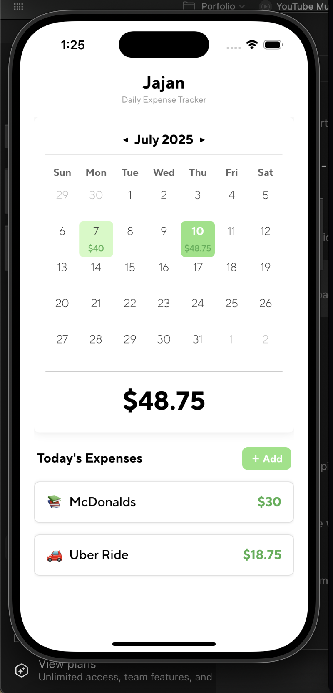
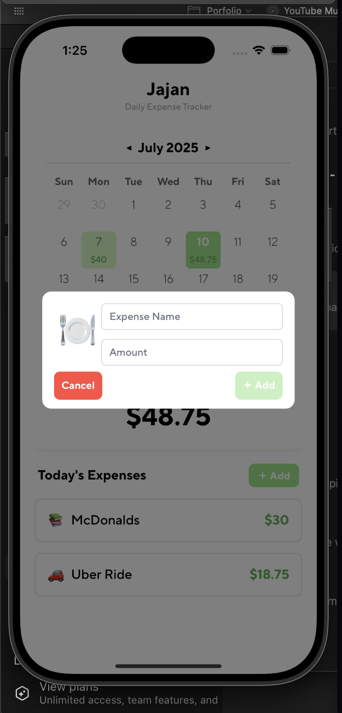
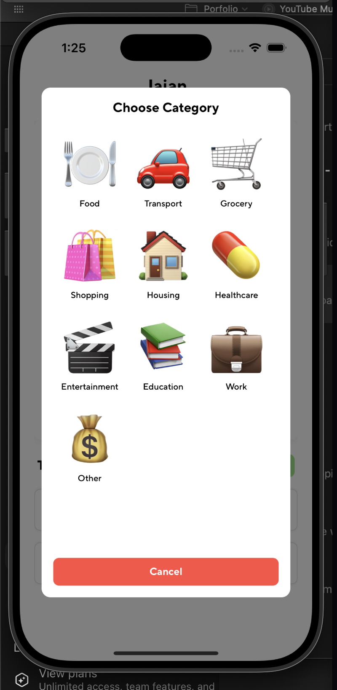
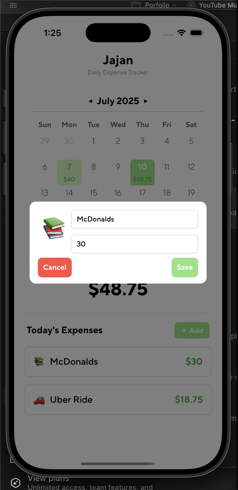
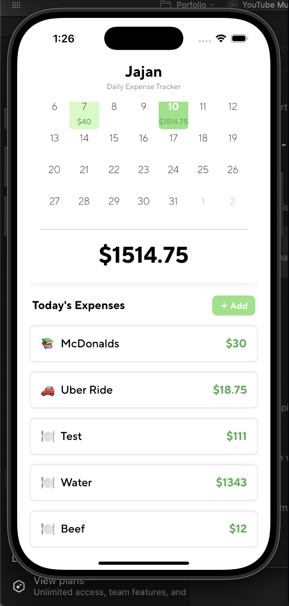

# 📱 Jajan

**Jajan** – the name is inspired by my home country, Indonesia. It means *buying treats*.  

I’m pretty bad at making good financial decisions due to my impulsiveness, so I built this app to hold myself accountable for my spending.

---

## 🚀 Features

- Track daily expenses by date
- Categorize expenses with emoji-based categories
- Scroll through long lists of expenses on a selected day
- Simple and intuitive interface with add/edit modals

---

## 🗂️ Project Structure

```
/app
  - Main app code lives here
```

---

## ⚡️ Setup

```
npx expo start
```

Requires [Expo CLI](https://docs.expo.dev/get-started/installation/) installed.

---

## 📸 Screenshots

<h3>Main Page</h3>


<h3>Add Expense Modal</h3>


<h3>Add Category Modal</h3>


<h3>Edit Expense Modal</h3>


<h3>Example of long, scrollable expense list</h3>


---

## 📝 License

No license.
